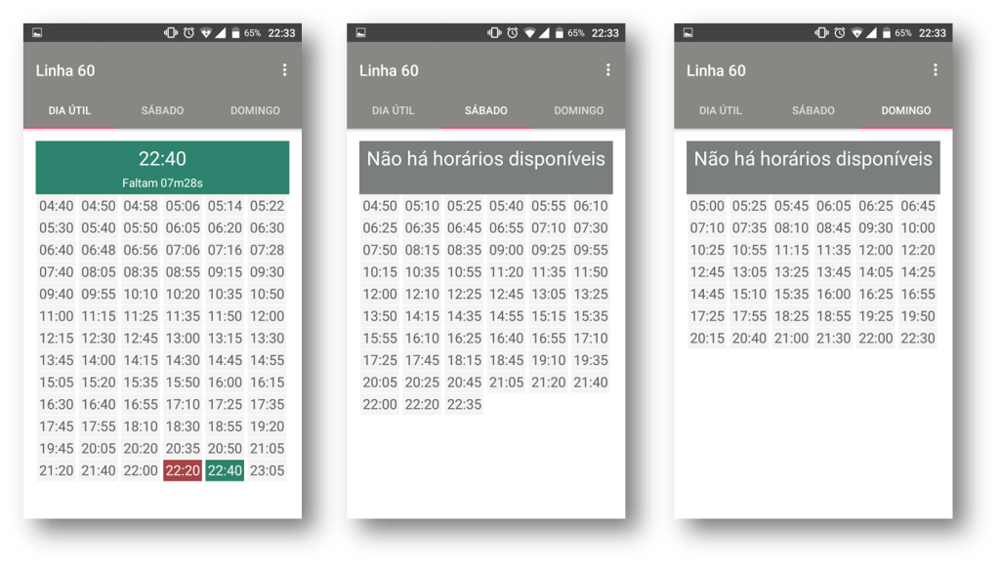

# Bus Schedules

---
Bus Schedules é um aplicativo para dispositivos android, desenvolvido para exibir horários de saída do terminal da linha 60 da empresa Guanabara em Natal. 
* O aplicativo busca os horários dinamicamente na internet e salva no dispositivo;
* Pode ser utilizado sem conexão com a internet, desde que os horários já tenham sido salvos anteriormente;
* Subdivide os horários por dia: Dia útil, Sábado, Domingo/feriado;
* Exibe todos os horários por categoria;
* Reconhece o dia atual, exibindo informações extras como:
    * Mostra o horário do próximo ônibos a sair;
    * Mostra o horário do último ônibos que saiu;
    * Mostra o horário exato de saída do próximo ônibos (atualizado diâmicamente);

## Desenvolvedor

 | 
---|
|Felipe Barbalho|